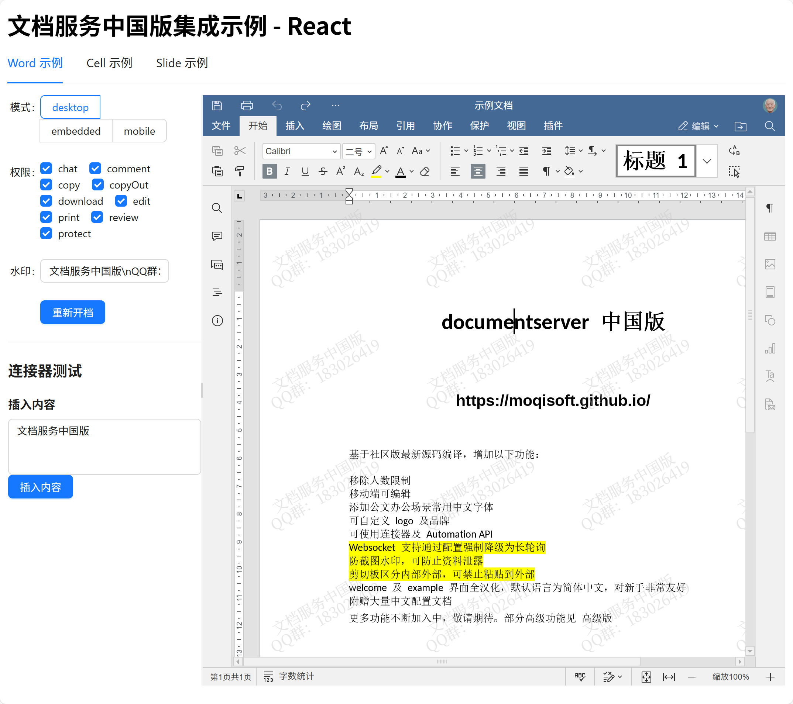

# onlyoffice 中国版集成示例

## 关于 documentserver 中国版

基于社区版最新源码编译，增加以下功能：

- 移除人数限制
- 移动端可编辑
- 添加公文办公场景常用中文字体
- 可自定义 logo 及品牌
- 可使用连接器及 Automation API
- Websocket 支持通过配置强制降级为长轮询
- 防截图水印，可防止资料泄露
- 剪切板区分内部外部，可禁止粘贴到外部
- welcome 及 example 界面全汉化，默认语言为简体中文，对新手非常友好
- 附赠大量中文配置文档

更多功能不断加入中，敬请期待。部分高级功能见 [高级版](https://moqisoft.github.io/docs/product/vip)

## 如何使用示例

1. 本地需要先安装 nodejs，安装并启动中国版最新版容器，并使用自带 `example` 验证服务正常。
2. 修改本项目的配置文件 `config.ts` 中的 `host` 和 `documentServerUrl` 为你本地的地址（注意不能是 localhost 或者 127.0.0.1）
3. 安装依赖并启动服务

```bash
npm install

npm run all
```

## react 集成

访问 `http://host:4000`

## vue 集成

// todo

## 服务端

服务端仅实现了最简单的 open 和 callback 接口，分别用于获取开档配置和保存回调



